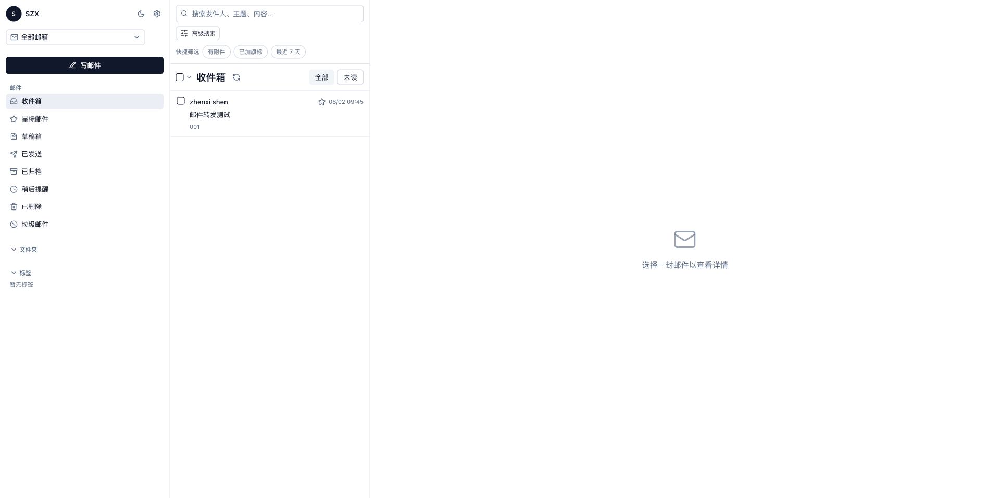
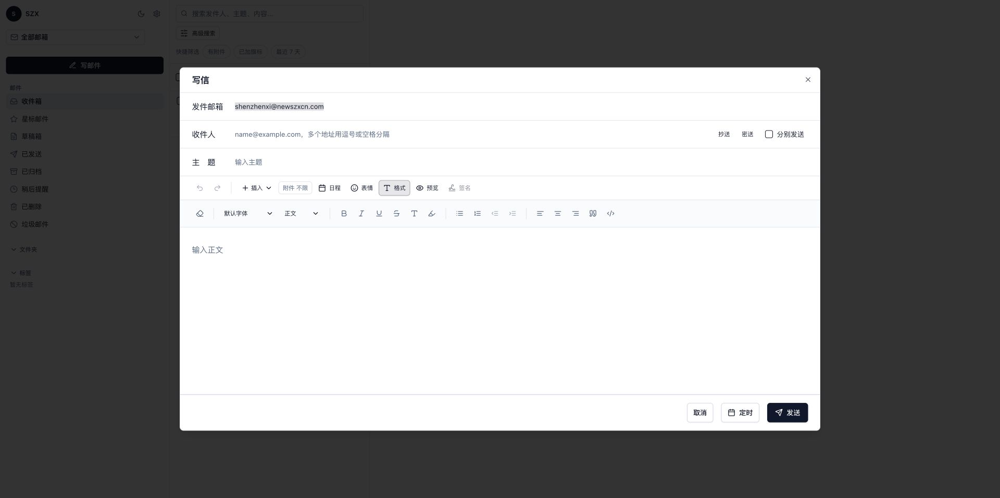
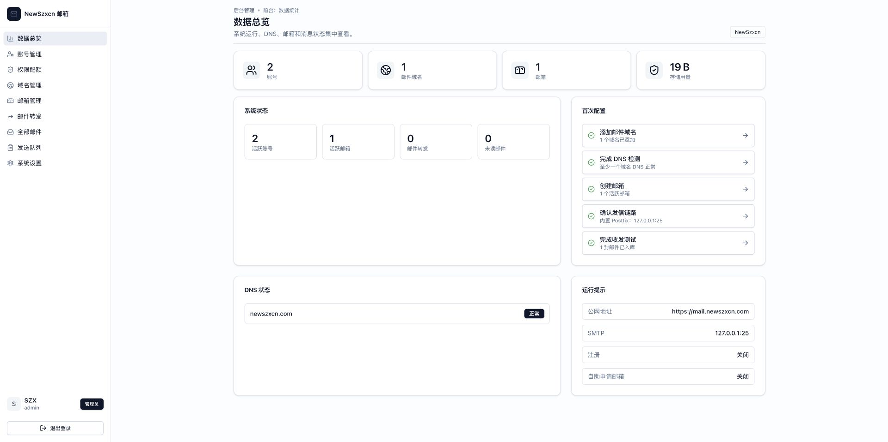
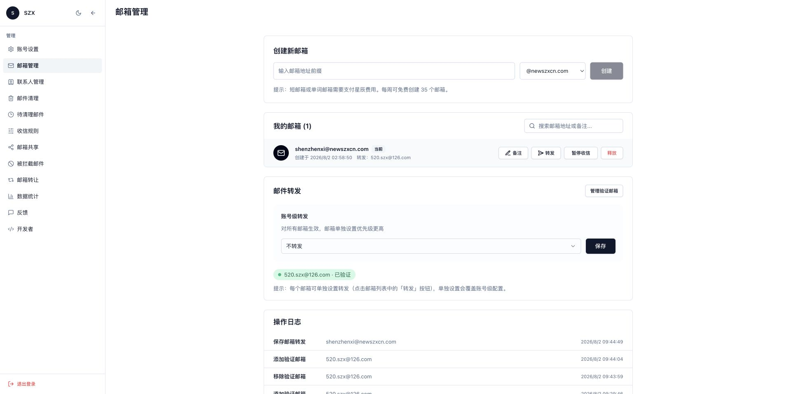

# LanQin Email

[](./README.en.md)
[](./README.md)


LanQin Email 是一个自建邮箱 Webmail 全栈方案：前端使用 React + TypeScript + shadcn/ui，后端使用 Go + SQLite，部署时可用单容器集成 API、Web、Nginx、Postfix、Dovecot、Rspamd。

交流群组：[Telegram 群组](https://t.me/+EhII7MSyi3QwNDQ5)

## 功能特性

- **Webmail 客户端**：多邮箱切换、文件夹、邮件读写、草稿、定时发送、附件、搜索、标签、星标、移动/删除、已读/未读。
- **邮箱增强**：联系人、签名、收件规则、发件人黑名单、邮件统计、归档已读、清空回收站/垃圾邮件。
- **多域名/多邮箱**：域名管理、DKIM 密钥生成、DNS 记录展示与检测、邮箱账号、别名转发、无人收件开关。
- **账号与权限**：登录/注册、会话管理、TOTP 两步验证、Cloudflare Turnstile、用户自助申请邮箱、权限组/RBAC。
- **管理员面板**：概览清单、用户/权限组/域名/邮箱/别名/全部邮件管理、系统设置、邮件模板、SMTP 测试。
- **邮件服务栈**：Postfix 投递、Dovecot IMAP/POP3、Rspamd 反垃圾与 DKIM 签名、Maildir 到 SQLite 同步。
- **部署友好**：默认 all-in-one 单容器，也提供多容器 stack 方便调试 Postfix/Dovecot/Rspamd。

## 界面预览

| Webmail 邮件阅读与列表 | 写邮件 · 富文本编辑工具栏 |
| --- | --- |
|  |  |
| 多邮箱切换、文件夹、搜索、标签、星标与邮件阅读面板。 | 富文本工具栏支持字体、标题、加粗、斜体、下划线、颜色、高亮、列表、对齐、引用、代码块、附件、表情与定时发送。 |
| 管理后台 · 系统概览 | 第三方客户端配置 |
|  |  |
| 管理用户、权限组、域名、邮箱、别名、系统设置与发送审计。 | 一键查看 IMAP / POP3 / SMTP 服务器、端口、安全方式与账号信息。 |

## 目录结构

```text
.
├── apps/api              # Go API、SQLite schema、邮件同步与业务逻辑
├── apps/web              # React/Vite Webmail 与管理后台
├── deploy                # Docker Compose、镜像构建、Postfix/Dovecot/Rspamd 配置
└── .github/workflows     # Docker 镜像发布流水线
```

## 环境要求

### 开发环境

- Go 1.25+
- Node.js 20+
- pnpm 10.28.2（可通过 corepack 启用）

### 部署环境

- Docker Engine
- Docker Compose v2
- 可解析的邮件域名，以及可用的 25 / 465 / 587 / 993 / 995 等端口

> 公网收发邮件还需要正确配置 MX、SPF、DKIM、DMARC，并确认云厂商未封禁 SMTP 端口。

## 快速开始

### 本地开发

后端：

```bash
cd apps/api
go mod download
go test ./...
go run ./cmd/server
```

前端（新终端）：

```bash
cd apps/web
corepack enable
corepack prepare pnpm@10.28.2 --activate
pnpm install
pnpm run dev
```

访问：

- Web：`http://localhost:5173`
- API：`http://localhost:8080`

默认管理员邮箱为 `admin@lanqin.local`。建议开发时显式设置 `LANQIN_ADMIN_PASSWORD`；如果未设置，后端首次启动会随机生成密码并输出到日志。

### Docker 部署（单容器）

服务器只需要 `deploy/` 下的 Compose 文件和配置，不需要源码构建：

```bash
cd deploy
cp .env.example .env
# 修改 .env：域名、访问地址、管理员邮箱、管理员密码等
docker compose pull
docker compose up -d
```

常用命令：

```bash
# 查看日志
docker compose logs -f lanqin-email

# 更新镜像并重启
docker compose pull
docker compose up -d

# 停止服务
docker compose down
```

如需在完整源码仓库中本地构建镜像：

```bash
cd deploy
cp .env.example .env
docker compose -f docker-compose.yml -f docker-compose.build.yml up -d --build
```

更多部署细节见 [`deploy/README.md`](./deploy/README.md)。

## 首次部署清单

1. 编辑 `deploy/.env`：至少修改 `LANQIN_PUBLIC_HOSTNAME`、`LANQIN_PUBLIC_BASE_URL`、`LANQIN_ADMIN_EMAIL`、`LANQIN_ADMIN_PASSWORD`。
2. 生产环境建议挂载真实 TLS 证书，并设置 `LANQIN_TLS_CERT_FILE` / `LANQIN_TLS_KEY_FILE`。
3. 登录管理后台，添加邮件域名。
4. 在域名管理中复制并配置 MX、SPF、DKIM、DMARC 记录，然后点击 DNS 检测。
5. 创建邮箱账号、别名转发或权限组，按需开启注册、2FA、Turnstile、自助申请邮箱。
6. 使用后台 SMTP 测试与 Webmail 收发测试确认链路正常。

## 关键环境变量

完整配置见 [`deploy/.env.example`](./deploy/.env.example)。常用变量如下：

| 变量 | 说明 | 默认/示例 |
|------|------|-----------|
| `LANQIN_IMAGE` | all-in-one 镜像 | `ghcr.io/lanqin996/lanqin-email:latest` |
| `LANQIN_PUBLIC_HOSTNAME` | 邮件服务器主机名，影响 Postfix/DNS 展示/链接 | `mail.example.com` |
| `LANQIN_PUBLIC_BASE_URL` | Webmail 对外访问地址 | `https://mail.example.com` |
| `LANQIN_ADMIN_EMAIL` | 初始管理员邮箱 | `admin@example.com` |
| `LANQIN_ADMIN_PASSWORD` | 初始管理员密码，生产必须修改 | `ChangeMe123!` |
| `LANQIN_DB_PATH` | SQLite 数据库路径 | `/data/lanqin.db` |
| `LANQIN_ALLOW_INSECURE_HTTP` | 是否允许非 HTTPS Cookie，本地调试可开 | `false` |
| `LANQIN_OPEN_REGISTRATION` | 是否开放注册 | `false` |
| `LANQIN_TWO_FACTOR_ENABLED` | 2FA 功能总开关 | `false` |
| `LANQIN_TURNSTILE_ENABLED` | 是否启用 Turnstile | `false` |
| `LANQIN_SMTP_HOST` / `LANQIN_SMTP_PORT` | Webmail 发信 SMTP | `127.0.0.1` / `25` |
| `LANQIN_MAILDIR_ROOT` | Maildir 根目录 | `/var/mail/vhosts` |
| `LANQIN_CATCH_ALL_ENABLED` | 未注册收件地址是否进入全部邮件 | `false` |
| `LANQIN_USER_MAILBOX_APPLY_ENABLED` | 是否允许用户自助申请邮箱 | `false` |
| `LANQIN_EXTERNAL_IMAP_ENABLED` | 是否启用外部 IMAP 接入；也可在后台“系统设置 > 外部 IMAP”配置 | `false` |
| `LANQIN_EXTERNAL_IMAP_SECRET_KEY` | 外部 IMAP 密码加密密钥，启用接入前必须设置；也可在后台配置 | 随机长字符串 |
| `LANQIN_EXTERNAL_IMAP_SYNC_SECONDS` | 外部 IMAP 本地存储模式同步间隔；也可在后台配置 | `300` |
| `LANQIN_EXTERNAL_IMAP_ALLOW_PRIVATE_HOSTS` | 是否允许外部 IMAP 连接内网/localhost 主机；也可在后台配置 | `false` |
| `LANQIN_EXTERNAL_IMAP_GMAIL_CLIENT_ID` / `LANQIN_EXTERNAL_IMAP_GMAIL_CLIENT_SECRET` | Gmail 外部 IMAP OAuth2，回调为 `/api/external-imap-oauth/gmail/callback` | 空 |
| `LANQIN_EXTERNAL_IMAP_OUTLOOK_CLIENT_ID` / `LANQIN_EXTERNAL_IMAP_OUTLOOK_CLIENT_SECRET` | Microsoft 365 / Outlook 外部 IMAP OAuth2，回调为 `/api/external-imap-oauth/outlook/callback` | 空 |

## 架构

```text
┌────────────────────────────────────────────────────────────┐
│                    lanqin-email 单容器                     │
│                                                            │
│  ┌─────────┐       ┌────────────┐       ┌──────────────┐   │
│  │  Nginx  │ ───▶  │ Go API     │ ───▶  │ SQLite /data │   │
│  │ Web 静态│       │ Webmail API│       └──────┬───────┘   │
│  └─────────┘       └─────┬──────┘              │           │
│                          │ Maildir sync        │ maps      │
│  ┌─────────┐       ┌─────▼──────┐       ┌──────▼───────┐   │
│  │ Rspamd  │ ◀───▶ │ Postfix    │ ───▶  │ Dovecot/LMTP │   │
│  │ DKIM/AS │       │ SMTP/MTA   │       │ IMAP/POP3    │   │
│  └─────────┘       └────────────┘       └──────────────┘   │
└────────────────────────────────────────────────────────────┘
```

邮件流转：

1. **收件**：Postfix 接收邮件 → Rspamd 评分/标记 → Dovecot 写入 Maildir → API worker 同步到 SQLite → Webmail 展示。
2. **发件**：Webmail 调用 API → API 构造 MIME → SMTP 提交给 Postfix 或外部 SMTP → 投递到目标地址。
3. **本地投递**：开发环境中，系统内邮箱互发可直接写入对方 Inbox；未配置 `LANQIN_SMTP_HOST` 时不会真正投递外部收件人。
4. **第三方客户端**：可通过 SMTP 465/587、IMAP 993、POP3 995 连接；生产环境请配置匹配 `LANQIN_PUBLIC_HOSTNAME` 的证书。
5. **外部邮箱接入**：个人邮箱管理可添加外部 IMAP 账号。本地存储模式会同步入库；远端直连模式每次读取远端，不写入本地邮件表。

## 开放 API

外部系统应使用版本化的 `/api/open/v1` 接口和带 scope 的 API Token。详细说明见 [API 文档](docs/API.md)，机器可读契约见 [OpenAPI 3.1](docs/openapi.json)。发信支持幂等键；最终投递事件可通过签名入口写入，全部状态变化也可通过可靠的签名 webhook outbox 主动推送。

## 开发与验证

```bash
# API 测试
cd apps/api
go test ./...

# Web 检查与构建
cd apps/web
pnpm run check

# 单容器源码构建验证
cd deploy
docker compose -f docker-compose.yml -f docker-compose.build.yml up -d --build
```

## 生产注意事项

- 生产环境必须修改默认管理员密码，并妥善保管 `.env`、SQLite 数据库、Maildir 与 DKIM 私钥。
- Web 可放在宿主机 Nginx/宝塔/边缘网关后，但 SMTP/IMAP/POP3 证书需要单独挂载给容器内 Postfix/Dovecot。
- 云厂商常默认封禁 25 端口；无法收发公网邮件时先检查端口、安全组、防火墙与反向 DNS。
- SQLite 适合单机部署；多节点部署前需要迁移数据库，并同步调整 Postfix/Dovecot 查询配置。

## SMTP 提交

- 第三方客户端的 SMTP 提交 `465/587` 由 LanQin API 进程处理。
- 启用 SMTP 提交前必须配置 `LANQIN_TLS_CERT_FILE` / `LANQIN_TLS_KEY_FILE`；API 不会用 localhost 自签证书对外提供 465/587。
- Postfix 只保留 `25` 端口，用于公网入站邮件和内部/外部 relay。
- Webmail/API 和第三方客户端发信都会先写入 Sent，再进入发送队列。
- 发送队列由 LanQin API 后台 worker relay 到 `LANQIN_SMTP_HOST:LANQIN_SMTP_PORT`，失败会记录审计并按退避策略重试。
- v1 支持本人邮箱发信；如需 send-as，可使用启用的别名转发 source 指向本人邮箱，或在数据库中配置 `send_as_grants`。
- 如果客户端随后又通过 IMAP APPEND 写入自己的 Sent 副本，Maildir 同步会按 Sent 文件夹内的 `Message-ID` 去重。

## License

[MIT](./LICENSE)


## Star 趋势

<a href="https://www.star-history.com/?repos=LanQin996%2FLanQin-Email&type=date&legend=top-left">
 <picture>
   <source media="(prefers-color-scheme: dark)" srcset="https://api.star-history.com/chart?repos=LanQin996/LanQin-Email&type=date&theme=dark&legend=top-left" />
   <source media="(prefers-color-scheme: light)" srcset="https://api.star-history.com/chart?repos=LanQin996/LanQin-Email&type=date&legend=top-left" />
   
 </picture>
</a>

友情链接：[LINUX DO](https://linux.do/) —— 新的理想型社区
